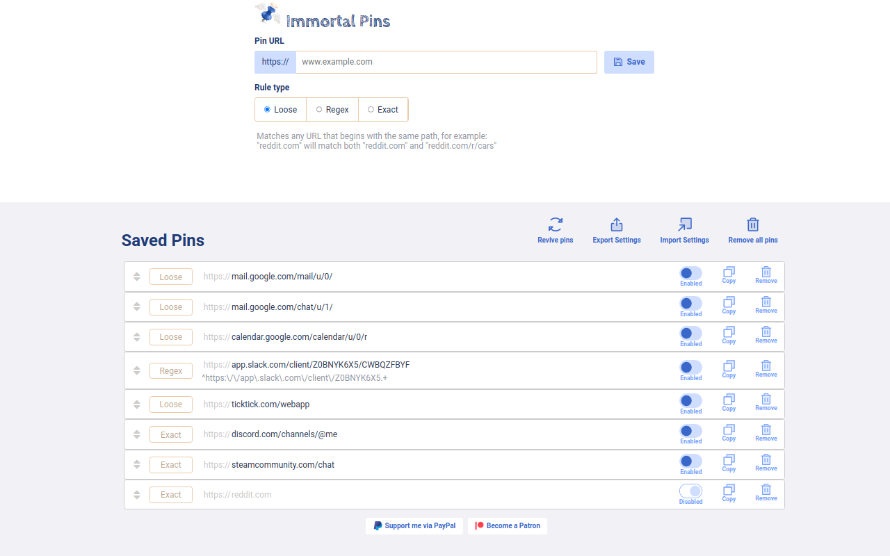

# Immortal Pins

Immortal Pins is a browser extension that lets you restore pinned tabs from a list of tabs that you define.

If you use the pinned tabs feature, you might have noticed that under some circumstances they can get closed, either by bugs in the browser or manually on accident by you.

This extension makes sure you can easily reopen and arrange them again if that happens.

* Ability to open a list of pinned tabs
* Supports simple predefined rules to determine whether a tab is already open
* Supports regex expressions to define more complex rules
* Arrange pinned tabs in a saved order
* Export/Import of settings

## Download
[Chrome web store](https://chrome.google.com/webstore/detail/afidegpkabcaoimfpnilmmmphfleeefo)

## Screenshots

## Support and Bug reports
[GitHub issues](https://github.com/C0rn3j/ImmortalPins/issues)

## Source and License

No code here so far, all rights reserved, very likely to change in the near future.
